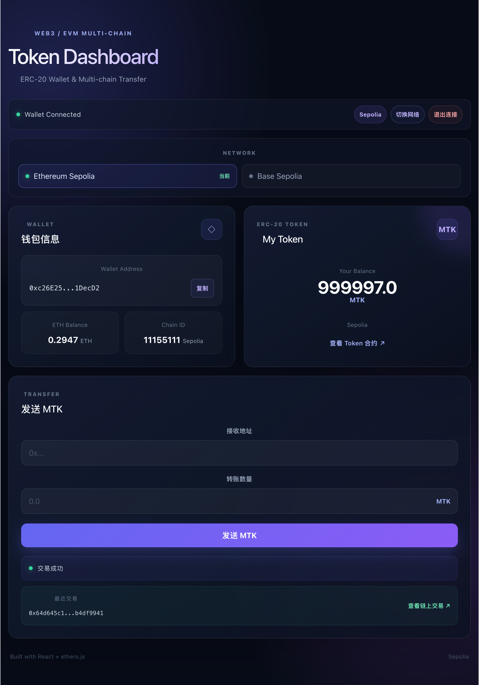
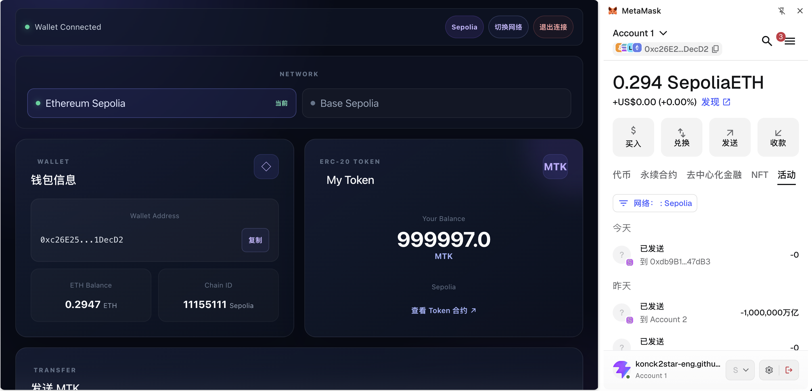
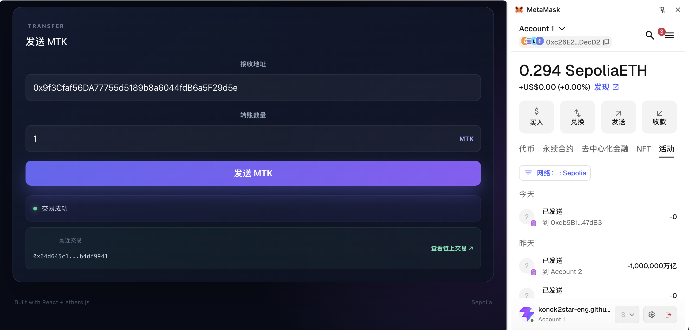
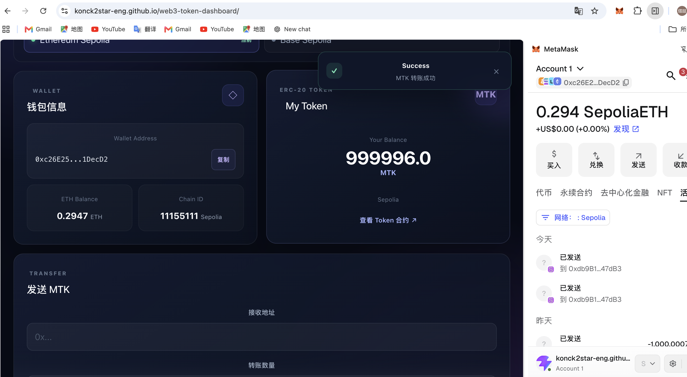

# Web3 Token Dashboard

一个基于 **React + TypeScript + Ethers.js + MetaMask** 构建的 Web3 Token Dashboard，用于实践 EVM 链上的钱包连接、链上资产读取、ERC-20 Token 转账、多链切换以及交易状态管理。

## 🚀 在线体验

**Live Demo**

https://konck2star-eng.github.io/web3-token-dashboard/

**GitHub**

https://github.com/konck2star-eng/web3-token-dashboard

> 支持 Ethereum Sepolia 与 Base Sepolia 测试网络，建议使用安装了 MetaMask 的浏览器体验。

---

## ✨ 核心功能

### 钱包连接

* 连接 MetaMask 钱包
* 获取当前钱包地址
* 读取 ETH 余额
* 监听钱包账户变化
* 监听当前网络变化
* 支持前端退出 DApp 会话

### ERC-20 Token

* 读取 Token 名称
* 读取 Token Symbol
* 读取 Token Decimal
* 查询当前钱包 MTK 余额
* 调用 ERC-20 `transfer()` 完成 Token 转账
* 转账完成后自动刷新余额

### 多链支持

目前支持：

| 网络               |   Chain ID | Token 合约                                     |
| ---------------- | ---------: | -------------------------------------------- |
| Ethereum Sepolia | `11155111` | `0xbBfc07FB4758c87057453978f14f52f59CCc808b` |
| Base Sepolia     |    `84532` | `0x3f163397f7FFbE8E99438F4A07BCB9E995c3a21b` |

前端根据当前 `Chain ID` 动态加载对应的：

* RPC 配置
* Token 合约地址
* 区块浏览器地址
* 网络名称

### 交易状态管理

Token 转账流程包含：

* 转账参数校验
* 钱包网络校验
* 收款地址校验
* 防止向当前账户自身转账
* Token 数量校验
* 余额校验
* MetaMask 用户拒绝交易处理
* 交易提交状态展示
* 等待链上确认
* Transaction Hash 保存
* 区块浏览器跳转
* 交易成功后自动刷新 Token 余额

---

## 🛠 技术栈

### Frontend

* React
* TypeScript
* Vite
* HTML5
* CSS3

### Web3

* Ethers.js
* MetaMask
* Ethereum
* Base
* EVM
* ERC-20

### Smart Contract

* Solidity
* OpenZeppelin ERC-20
* Remix
* Hardhat
* Sepolia
* Base Sepolia

### Deployment

* GitHub
* GitHub Actions
* GitHub Pages

---

## 🏗 技术架构

```text
┌─────────────────────────────┐
│        React + TypeScript   │
│                             │
│  WalletCard                 │
│  TokenCard                  │
│  TransferForm               │
│  Toast                      │
└──────────────┬──────────────┘
               │
               │ Ethers.js
               ▼
┌─────────────────────────────┐
│          MetaMask           │
│                             │
│   Provider / Signer         │
└──────────────┬──────────────┘
               │
               ▼
┌─────────────────────────────┐
│         EVM Network          │
│                             │
│ Ethereum Sepolia             │
│ Base Sepolia                 │
└──────────────┬──────────────┘
               │
               ▼
┌─────────────────────────────┐
│      MyToken ERC-20         │
│                             │
│ balanceOf()                 │
│ transfer()                  │
└─────────────────────────────┘
```

---

## 🔗 Web3 交互流程

### 1. 连接钱包

前端通过 `window.ethereum` 获取 MetaMask 注入的 Provider：

```ts
const provider = new BrowserProvider(window.ethereum);
```

然后请求用户连接钱包：

```ts
await window.ethereum.request({
  method: "eth_requestAccounts",
});
```

---

### 2. 读取账户信息

连接成功后，通过 Ethers.js 获取当前钱包地址：

```ts
const signer = await provider.getSigner();
const address = await signer.getAddress();
```

同时读取 ETH 余额：

```ts
const balance = await provider.getBalance(address);
```

通过：

```ts
formatEther(balance)
```

将 Wei 转换成人类可读的 ETH 数量。

---

### 3. 创建 ERC-20 Contract

前端根据当前网络加载对应的 Token 合约：

```ts
const contract = new Contract(
  tokenAddress,
  tokenAbi,
  provider
);
```

通过 `Contract` 实例调用智能合约方法。

---

### 4. 读取 Token 余额

调用 ERC-20 标准接口：

```ts
const rawBalance = await contract.balanceOf(address);
```

再结合 Token 的 decimals：

```ts
formatUnits(rawBalance, decimals);
```

最终得到用户可以直接阅读的 Token 余额。

---

### 5. 发起 Token 转账

需要用户签名的交易不能只使用 Provider，因此前端获取 Signer：

```ts
const signer = await provider.getSigner();
```

然后使用连接了 Signer 的 Contract：

```ts
const contract = new Contract(
  tokenAddress,
  tokenAbi,
  signer
);
```

Token 数量通过：

```ts
parseUnits(amount, decimals);
```

进行精度转换，然后调用：

```ts
const tx = await contract.transfer(
  recipient,
  tokenAmount
);
```

---

### 6. 等待交易确认

交易提交后先获取 Transaction Hash：

```ts
tx.hash
```

然后等待区块链确认：

```ts
await tx.wait();
```

确认完成后重新读取 Token 余额，使前端状态与链上状态保持同步。

---

## 🔐 Provider、Signer、Contract

这个项目中三个核心 Web3 对象分别承担不同职责：

| 对象       | 主要作用               |
| -------- | ------------------ |
| Provider | 连接区块链、读取链上数据       |
| Signer   | 代表当前钱包签名并发送交易      |
| Contract | 根据 ABI 与合约地址调用智能合约 |

可以简单理解为：

```text
Provider
   ↓
只读链上数据

Signer
   ↓
钱包签名 / 发起交易

Contract
   ↓
通过 ABI 调用智能合约
```

---

## 📦 ERC-20 Smart Contract

项目使用 OpenZeppelin ERC-20 实现 Token：

```solidity
// SPDX-License-Identifier: MIT
pragma solidity ^0.8.20;

import "@openzeppelin/contracts/token/ERC20/ERC20.sol";

contract MyToken is ERC20 {
    constructor() ERC20("My Token", "MTK") {
        _mint(msg.sender, 1000000 * 10 ** decimals());
    }
}
```

Token 信息：

* Name：`My Token`
* Symbol：`MTK`
* Initial Supply：`1,000,000 MTK`

---

## 🔗 合约地址

### Ethereum Sepolia

```text
0xbBfc07FB4758c87057453978f14f52f59CCc808b
```

Etherscan：

https://sepolia.etherscan.io/address/0xbBfc07FB4758c87057453978f14f52f59CCc808b

### Base Sepolia

```text
0x3f163397f7FFbE8E99438F4A07BCB9E995c3a21b
```

BaseScan：

https://sepolia.basescan.org/address/0x3f163397f7FFbE8E99438F4A07BCB9E995c3a21b

---

## 📁 项目结构

```text
web3-token-dashboard/
├── .github/
│   └── workflows/
│       └── deploy.yml
│
├── contracts/
│   └── MyToken.sol
│
├── scripts/
│   └── deploy.js
│
├── src/
│   ├── components/
│   │   ├── WalletCard.tsx
│   │   ├── TokenCard.tsx
│   │   ├── TransferForm.tsx
│   │   └── Toast.tsx
│   │
│   ├── App.tsx
│   ├── App.css
│   ├── index.css
│   └── main.tsx
│
├── .gitignore
├── hardhat.config.js
├── package.json
├── package-lock.json
├── tsconfig.json
├── vite.config.ts
└── README.md
```

---

## ⚙️ 本地运行

### 1. 克隆项目

```bash
git clone https://github.com/konck2star-eng/web3-token-dashboard.git
```

进入项目目录：

```bash
cd web3-token-dashboard
```

### 2. 安装依赖

```bash
npm install
```

### 3. 启动开发环境

```bash
npm run dev
```

启动后访问：

```text
http://localhost:5173/
```

---

## ✅ 已验证功能

目前已经在测试网络完成实际验证：

```text
✅ MetaMask 钱包连接

✅ 钱包地址读取

✅ ETH 余额读取

✅ MTK Token 余额读取

✅ Ethereum Sepolia 支持

✅ Base Sepolia 支持

✅ Sepolia / Base Sepolia 网络切换

✅ ERC-20 Token 转账

✅ MetaMask 交易签名

✅ Transaction Hash 获取

✅ 等待链上交易确认

✅ 转账成功后余额自动更新

✅ Etherscan / BaseScan 交易查询

✅ GitHub Actions 自动构建

✅ GitHub Pages 在线部署
```

---

## 🚀 CI/CD

项目使用 GitHub Actions 完成前端自动部署。

当代码推送到 `main` 分支后：

```text
git push
   ↓
GitHub Repository
   ↓
GitHub Actions
   ↓
npm ci
   ↓
npm run build
   ↓
生成 dist
   ↓
GitHub Pages
   ↓
线上 DApp
```

因此修改前端代码后，只需要：

```bash
git add .
git commit -m "your commit message"
git push
```

GitHub Actions 即可自动执行构建和部署。

---

## 💡 项目实践重点

这个项目重点实践了 Web3 前端开发中比较核心的几个场景：

### 钱包交互

理解 DApp 前端如何通过浏览器钱包连接用户账户，以及如何监听账户和网络变化。

### 链上数据读取

通过 Provider 和 Contract 读取账户余额、Token 信息以及 ERC-20 状态。

### 链上交易

理解从前端发起交易，到 MetaMask 用户签名，再到区块链确认的完整流程。

### Token 精度

使用 `parseUnits()` 与 `formatUnits()` 处理 ERC-20 Token 的 decimals，避免直接使用 JavaScript 浮点数造成精度问题。

### 多链适配

通过 Chain ID 区分不同 EVM 网络，并动态加载对应的 RPC、Contract Address 与 Explorer。

### 前端状态管理

根据钱包连接、网络切换、交易提交、交易确认等不同状态更新 UI。

---

## 📸 项目预览

> 项目已经部署到 GitHub Pages，可以直接通过下面的链接体验。

**在线 Demo：**

https://konck2star-eng.github.io/web3-token-dashboard/

后续可以在这里补充项目截图：

```text
docs/
├── dashboard.png
├── wallet-connected.png
├── token-transfer.png
└── transaction-success.png
```

添加截图后，可以在 README 中使用：

```markdown







```

---

## 📌 后续规划

* 增加更多 EVM 网络
* 支持更多 Token
* 增加交易历史查询
* 增加 Gas 信息展示
* 增加多钱包连接支持
* 增加更多链上数据可视化能力

---

## 📄 License

MIT
